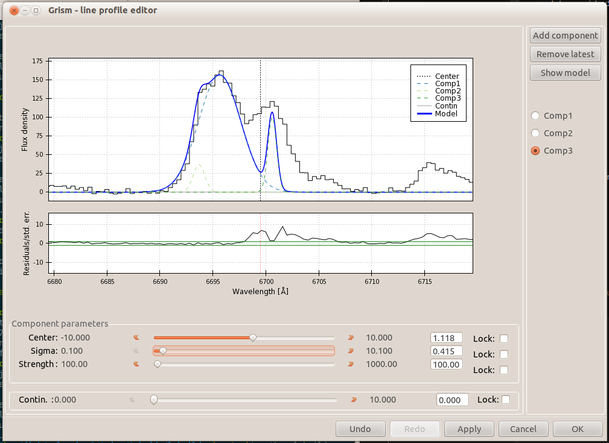
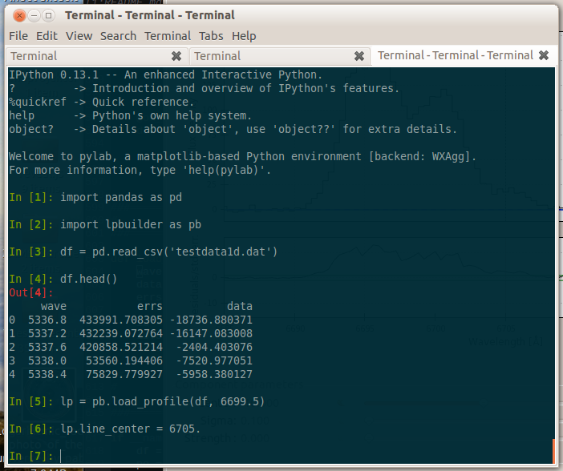

lpbuilder
=========

Stand-alone version of the line profile builder of grism.
This is mainly to share a working version with the community that is easier to call and initialize than the full grism version and comes with suitable demo data. Development is still going on in grism, but of course suggestions etc. are welcome for this version too.

 

Usage:
------

For demonstration purposes, simply run the file as a script either calling `python lpbuilder.py` or using the `%run` magic from the IPython prompt, or whatever method one might prefer.

For a bit of more tinkering, import the module and check the docstrings for usage.

Flaws, Caveats, Limitations & Gotchas:
-------------------------
*Multiple. This module is in active development. I hope it can be useful as-is or as an inspiration, though.*

* Only a simple constant-value continuum is supported at the moment.
* Only emission-gaussian components are supported at the moment.
* Undo/Redo/Apply doesn't work completely, consiering removing them.

Dependencies:
-------------

* Python 2.7 (may work with earlier versions but not tested).
* Traits
* TraitsUI
* Chaco
* Pandas
* SciPy

The former three are all part of the [Enthought Tool Suite][2] which can be installed from PyPI as `ets`, the latter two are both part of the standard [SciPy stack][1].

[1]: http://scipy.org
[2]: http://code.enthought.com
